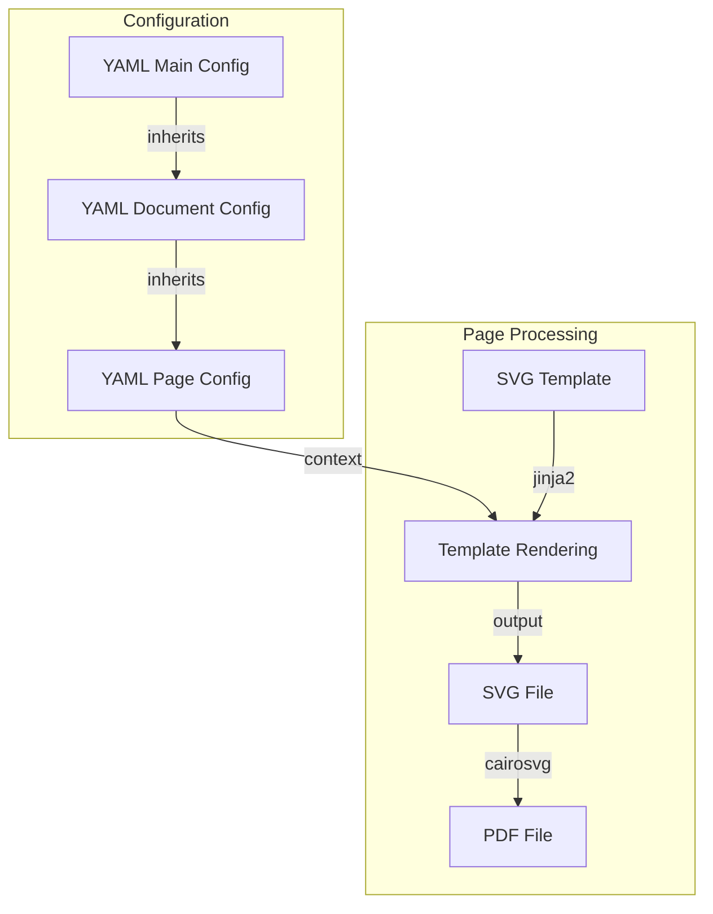

# Configuration Reference

<details>
<summary>Example Project Structure</summary>

```
project/
├── kiwipycon.yaml        # Main configuration
├── material_specs/       # A document
│   ├── config.yaml       # Document configuration
│   ├── images/           # The document's images
│   ├── pages/            # The document's pages
│   │   ├── cover.yaml    # Page configuration
│   │   └── main.yaml     # Page configuration
│   └── templates/        # The document's templates
│       └── page.svg.j2   # A template
└── prospectus/           # Another document
    ├── config.yaml
    ├── images/
    ├── pages/
    └── templates/
```

</details>

## Main Configuration File

At least `documents` has to be specified.

| Option                          | Type    | Default                              | Description                                                                                                                                                                                                                                                             |
| ------------------------------- | ------- | ------------------------------------ | ----------------------------------------------------------------------------------------------------------------------------------------------------------------------------------------------------------------------------------------------------------------------- |
| `documents` **required**        | array   | `[]`                                 | List of document configurations. A simple string specifies the name of a directory containing a `config.yaml` file. You can also specify `path` and `name` to a specific configuration YAML file.                                                                       |
| `directories.base` **readonly** | string  | directory containing the config file | Other directories are relative to this base directory.                                                                                                                                                                                                                  |
| `directories.build`             | string  | `"build"`                            | Intermediary SVG and PDF files are written here. Deleted unless `bake` is run with `--keep-build`                                                                                                                                                                       |
| `directories.dist`              | string  | `"dist"`                             | Final PDF files are written here.                                                                                                                                                                                                                                       |
| `directories.documents`         | string  | `"."`                                | Location of document configurations.                                                                                                                                                                                                                                    |
| `directories.images`            | string  | `"images"`                           | Location of image files.                                                                                                                                                                                                                                                |
| `directories.pages`             | string  | `"pages"`                            | Location of page configurations.                                                                                                                                                                                                                                        |
| `directories.templates`         | string  | `"templates"`                        | Location of SVG template files.                                                                                                                                                                                                                                         |
| `jinja2_extensions`             | array   | `[]`                                 | jinja2_extensions (like `jinja2.ext.do`) to load and use in templates.                                                                                                                                                                                                  |
| `template_renderers`            | array   | `["render_highlight"]`               | List of automatically applied renderers. `render_highlight` is currently the only available one and enabled by default. It will replace `<highlight>...</highlight>` with `<tspan>` using the colour `style.color` to let you highlight words inside YAML text.         |
| `template_filters`              | array   | `["wordwrap"]`                       | List of filters made available to templates. `wordwrap` is currently the only available filter. It splits text into lines so that full words have to fit within the specified total number of character for example ``. |
| `svg2pdf_backend`               | string  | `"cairosvg"`                         | Backend to use for SVG to PDF conversion. `"cairosvg"` is built-in, the alternative `"inkscape"` requires Inkscape to be installed                                                                                                                                      |
| `compress_pdf`                  | boolean | `false`                              | Whether to compress the final PDF. Requires Ghostscript to be installed.                                                                                                                                                                                                |
| `keep_build`                    | boolean | `false`                              | Whether to keep the `build` directory and its intermediary files. You can also pass `bake --keep-build` on individual calls to do this.                                                                                                                                 |
| _additional custom setting_     |         |                                      | Any settings you want to make available to all pages of all documents.                                                                                                                                                                                                  |

<details>
<summary>Example Main Configuration File</summary>

```yaml
# kiwipycon.yaml

documents:
  - prospectus
  - material_specs

style:
  text_color: {{theme.primary}}
  font_family: "Helvetica Neue"
  heading_size: {{theme.large}}
  spacing: {{theme.normal}}
  # Color for <highlight>text</highlight> tags
  highlight_color: {{theme.teal}}

theme:
  primary: "#30987c"
  secondary: "#2c3e50"
  teal: "#30987c"
  large: "24pt"
  normal: "12pt"
  small: "10pt"

compress_pdf: true
svg2pdf_backend: inkscape

# Custom settings available to all documents:
conference:
  year: 2025
  name: "Kiwi PyCon 2025"
  dates: "November 21-23, 2025"
venue:
  name: "Shed 6, Wellington"
```

</details>

## Document Configuration File

At least `filename` and `pages` has to be specified.

| Option                      | Type   | Default     | Description                                                                                                                                                                                                                                                     |
| --------------------------- | ------ | ----------- | --------------------------------------------------------------------------------------------------------------------------------------------------------------------------------------------------------------------------------------------------------------- |
| _any main setting_          |        |             | Any of the Main Configuration File settings can be overridden for a particular document.                                                                                                                                                                        |
| `filename` **required**     | string |             | Filename (without extension) of the final PDF document. Can use variables, particularly `variant` (see [Variants](variants.md))                                                                                                                                 |
| `pages` **required**        | array  |             | List of page configurations. A simple string specifies a file by the same name with `.yaml` extension in the document's _pages_ directory. You can also specify a `path` and `name` to a specific file (absolute or relative to the document's base directory). |
| `variants`                  | array  |             | List of document variants (see [Variants](variants.md)). These are their own sections which will be merged with the document configuration. During processing, `variant` will hold the current variant configuration.                                           |
| `custom_bake`               | string | `"bake.py"` | Python file used for custom processing (if found). A simple string specifies a filename in the document's _base_ directory. You can also specify a `path` and `name` to a specific file (absolute or relative to the document's _base_ directory).              |
| _additional custom setting_ |        |             | Any settings you want to make available to all pages of this document.                                                                                                                                                                                          |

<details>
<summary>Example Document Configuration File</summary>

```yaml
# prospectus/config.yaml

filename: "Kiwi PyCon {{ conference.year }} - Prospectus" # Use config values in config values!
title: "Sponsorship Prospectus"
compress_pdf: true

pages:
  - cover
  - venue_info
  - conference_schedule
```

</details>

## Page Configuration File

At least `template` has to be specified.

| Option                         | Type    | Default | Description                                                                                                                                                       |
| ------------------------------ | ------- | ------- | ----------------------------------------------------------------------------------------------------------------------------------------------------------------- |
| _any main or document setting_ |         |         | Any of the Main/Document Configuration File settings can be overridden for a particular page.                                                                     |
| `template` **required**        | string  |         | Filename of the SVG template (must be in the document's `templates/` directory)                                                                                   |
| `images`                       | array   |         | List of images to use in the page. Each image must have a `name` (filename in the document's `images/` directory) and optionally a `type` (defaults to "default") |
| `page_number` **readonly**     | integer |         | The number of the current page within its document                                                                                                                |
| _additional custom setting_    |         |         | Any settings you want to make available to this page. This allows you to have a template purely for layout purposes.                                              |

<details>
<summary>Example Page Configuration File</summary>

```yaml
# pages/conference_schedule.yaml

template: list_section.svg.j2

# Override global style settings
style:
  background: {{theme.secondary}}
  text_colour: {{theme.teal}}

images:
  - name: conference_speaker.jpg
  - name: conference_day_1.jpg
  - name: conference_day_2.jpg
  - name: conference_day_3.jpg

# Custom settings for list_section.svg.j2:
heading_1: Conference overview
heading_2: Outline of the conference schedule
text_1: |-
  <highlight>Kiwi PyCon</highlight> has been Python
  New Zealand's premier Python event since 2009.
  Now is the <highlight>best time</highlight> to
  contribute to the advancement of Aotearoa
  New Zealand's Python community
  and to invest in its growth.

list_items:
  - title: Friday 21st of November
    text: |-
      • Workshops
      • Tutorials
      • Exhibition Hall
      • Evening social event
  - title: Saturday 22nd of November
    text: |-
      • Opening
      • Keynote
      • Presentations
      • Exhibition Hall
  - title: Sunday 23rd of November
    text: |-
      • Keynote
      • Presentations
      • Exhibition Hall
      • Lightning Talks
      • Closing
```

</details>

## Template Context

For every page, your main configuration (for all documents), document configuration (for
all pages of the document) and the page configuration are merged to form the context
provided to your page template.



## Advanced Configuration

### Document Variants

Create multiple versions of a document by defining `variants` in the document
configuration:

```yaml
# Document configuration
filename: "{{ variant.name | lower }}_variant"
pages:
  - main
variants:
  - name: Diamond
    price: 10000
    benefits:
      - Logo on lanyard
      - Logo on t-shirt
    pages:
      - main
      - diamond_bonus
  - name: Platinum
    price: 5000
    benefits:
      - Logo on t-shirt
```

When a particular document is processed, each variant's configuration will be merged
into the document configuration, and `variant` will hold the configuration of the
current variant.

See [the variants example](../examples/variants) for a simple implementation of this in
action.

### Custom Processing

For advanced use cases, you can create a `bake.py` file in your document directory to
customize the document generation process.

Most importantly, this allows you to inject additional settings from sources like web
requests or database queries.

```python
from pdfbaker.document import Document

def process_document(document: Document) -> None:
    """Get settings from other places."""
    # Inject additional data into document.config
    document.config.profit_and_loss = query_xero_api()
    # Continue with regular processing
    return document.process()
```

See [the custom_processing example](../examples/custom_processing) for an implementation
that insert the latest XKCD comic into your PDF.

### Custom Locations

The above `directories` settings work out of the box, and expect your files to follow a
simple naming convention.

- You may not like these locations
- You may already have images sitting elsewhere and want to avoid multiple copies
- You want to create a document PDF in a webserver directory for people to download

You can customize all directories / file locations, even on a per-document basis:

```yaml
# Document configuration
filename: Monthly Report
directories:
  - images: "../../images"
  - dist: "/var/www/documents"
pages:
  - main
```

See [the custom_locations example](../examples/custom_locations) for an implementation
that goes off the default path.
