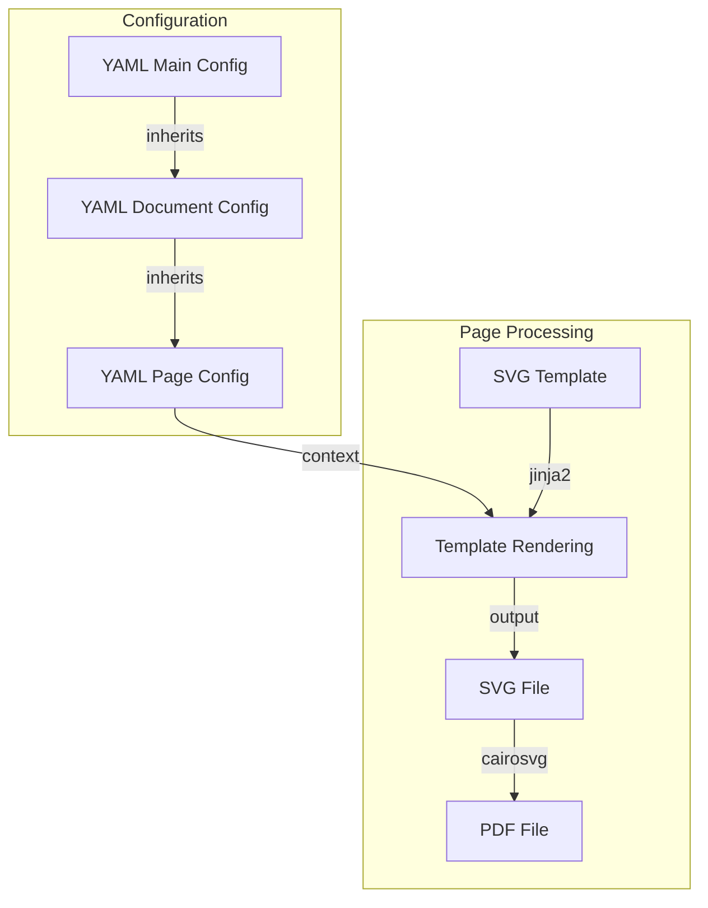

# Configuration

## Example Project Structure

```
project/
├── kiwipycon.yaml        # Main configuration
├── material_specs/       # A document
│   ├── config.yaml       # Document configuration
│   ├── images/           # Images
│   ├── pages/            # Page configurations
│   └── templates/        # SVG templates
└── prospectus/           # Another document
    ├── config.yaml
    ├── images/
    ├── pages/
    └── templates/
```

## Configuration Workflow

For every page, your main configuration (for all documents), document configuration (for
all pages of this document) and the page configuration are merged to form the context
provided to your page template.



## Main Configuration File

| Option            | Type    | Default      | Description                                                                                                        |
| ----------------- | ------- | ------------ | ------------------------------------------------------------------------------------------------------------------ |
| `documents`       | array   | Yes          | List of document directories. Each directory must contain a `config.yaml` file                                     |
| `style`           | object  | No           | Global style definitions that may reference `theme` values                                                         |
| `theme`           | object  | No           | Reusable values (colors, fonts, spacing, etc.) used by `style`                                                     |
| `compress_pdf`    | boolean | `false`      | Whether to compress the final PDF. Requires Ghostscript.                                                           |
| `svg2pdf_backend` | string  | `"cairosvg"` | Backend to use for SVG to PDF conversion. `"cairosvg"` is built-in, `"inkscape"` requires Inkscape to be installed |

You can use `<highlight>text</highlight>` tags in your templates, and they will be
highlighted in the color specified by the `highlight_color` in your `style`.

Example:

```yaml
# kiwipycon.yaml

documents:
  - prospectus
  - material_specs

style:
  highlight_color: teal # Color for <highlight>text</highlight> tags
  font_family: "Helvetica Neue"
  heading_size: large # from theme
  spacing: normal # from theme

theme:
  primary: "#30987c"
  secondary: "#2c3e50"
  teal: "#30987c"
  large: "24pt"
  normal: "12pt"
  small: "10pt"

compress_pdf: false
svg2pdf_backend: inkscape

# Custom content available to all documents:
content:
  conference:
    year: 2025
    name: "Kiwi PyCon 2025"
    dates: "November 21-23, 2025"
  venue:
    name: "Shed 6, Wellington"
```

## Document Configuration File

Document-specific settings and content. The main configuration will be merged with this
for each document.

| Option     | Type   | Required | Description                                                                                                                     |
| ---------- | ------ | -------- | ------------------------------------------------------------------------------------------------------------------------------- |
| `filename` | string | Yes      | Filename (without extension) of the final PDF document. Can use variables, particularly `variant` (see [Variants](variants.md)) |
| `pages`    | array  | Yes      | List of page names. Each page must have a corresponding `.yaml` file in the `pages/` directory                                  |
| `variants` | array  | No       | List of document variants (see [Variants](variants.md))                                                                         |

Example:

```yaml
# prospectus/config.yaml

filename: "Kiwi PyCon {{ conference.year }} - Prospectus" # Use config values in config values!
title: "Sponsorship Prospectus"
compress_pdf: true

pages:
  - cover
  - venue_info
  - conference_schedule
```

## Page Configuration File

Page-specific settings and content. The (already merged) document configuration will be
merged with this for access to all settings in your template.

| Option     | Type   | Required | Description                                                                                                                                                       |
| ---------- | ------ | -------- | ----------------------------------------------------------------------------------------------------------------------------------------------------------------- |
| `template` | string | Yes      | Filename of the SVG template (must be in the document's `templates/` directory)                                                                                   |
| `images`   | array  | No       | List of images to use in the page. Each image must have a `name` (filename in the document's `images/` directory) and optionally a `type` (defaults to "default") |

Example:

```yaml
# pages/conference_schedule.yaml

template: list_section.svg.j2

# Override global style settings
style:
  background: off_white
  secondary_text_colour: grey

images:
  - name: conference_speaker.jpg
  - name: conference_day_1.jpg
  - name: conference_day_2.jpg
  - name: conference_day_3.jpg

# Custom settings for list_section.svg.j2:
heading_1: Conference overview
heading_2: Outline of the conference schedule
text_1: |-
  <highlight>Kiwi PyCon</highlight> has been Python
  New Zealand's premier Python event since 2009.
  Now is the <highlight>best time</highlight> to
  contribute to the advancement of Aotearoa
  New Zealand's Python community
  and to invest in its growth.

list_items:
  - title: Friday 21st of November
    text: |-
      • Workshops
      • Tutorials
      • Exhibition Hall
      • Evening social event
  - title: Saturday 22nd of November
    text: |-
      • Opening
      • Keynote
      • Presentations
      • Exhibition Hall
  - title: Sunday 23rd of November
    text: |-
      • Keynote
      • Presentations
      • Exhibition Hall
      • Lightning Talks
      • Closing
```

## Template Context

Configuration is merged in this order:

1. Main config
2. Document config
3. Variant config (if processing [a variant](variants.md))
4. Page config

The entire merged configuration is available to your templates. This means:

1. You can put any data you want in your configuration
2. The three levels (main, document, page) are just for organisation (Don't Repeat
   Yourself)
3. Later levels override earlier ones if keys conflict

### Available Variables

| Variable       | Description                                                                                                                       |
| -------------- | --------------------------------------------------------------------------------------------------------------------------------- |
| `style`        | Resolved style definitions (if style/theme are defined)                                                                           |
| `images`       | List of image objects, each with `name` and `type` (as specified) and also `data` (base64-encoded data for inclusion in the page) |
| Any other keys | All other configuration is passed through as-is                                                                                   |

You can use `<highlight>text</highlight>` tags in your templates, and they will be
highlighted in the color specified by the `highlight_color` in your `style` (see "Main
Configuration File" above).

## Document Variants

Create multiple versions of a document by defining variants in the document
configuration:

```yaml
# Document config
variants:
  - name: Diamond
    content:
      price: 10000
      benefits:
        - Logo on lanyard
        - Logo on t-shirt
  - name: Platinum
    content:
      price: 5000
      benefits:
        - Logo on t-shirt
```

## Custom Processing

For advanced use cases, you can create a `bake.py` file in your document directory to
customize the document generation process. This allows you to:

- Add custom preprocessing steps
- Modify content dynamically
- Generate content programmatically
- Handle complex document structures

Basic structure:

```python
from pdfbaker.document import PDFBakerDocument

def process_document(document: PDFBakerDocument) -> None:
    # Custom processing logic here
    pass
```
