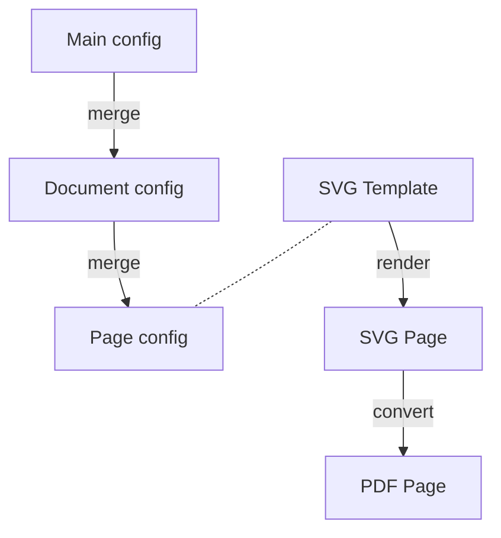
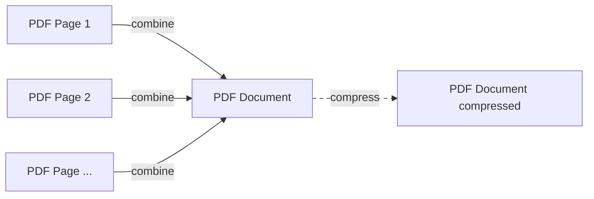

# pdfbaker Overview

pdfbaker is a tool for generating PDF documents from SVG templates and YAML
configuration. It's designed to be flexible and powerful, allowing you to create complex
documents with minimal effort.

## Key Features

- **SVG Layout Control**: Full control over document layout and design
- **Simple Configuration**: YAML for easy content management
- **Dynamic Content**: Jinja2 templating for variable text, conditions, and loops
- **Document Variants**: Create multiple versions of the same document
- **Custom Processing**: Extend the processing workflow with Python
- **PDF Compression**: Optional compression of final PDFs





## Documentation

- [Configuration](configuration.md) - How to set up your documents
- [Document Variants](variants.md) - Create multiple versions of a document
- [Custom Processing](custom_processing.md) - Extend the processing workflow

## Quickstart

For a quick introduction, see the [README](../README.md).

## Examples

See the [examples](examples) directory:

- [minimal](examples/minimal) - Basic usage
- [regular](examples/regular) - Standard features
- [variants](examples/variants) - Document variants
- [custom_locations](examples/custom_locations) - Custom file/directory locations
- [custom_processing](examples/custom_processing) - Custom processing with Python

## Example Project Structure

```
project/
├── kiwipycon.yaml        # Main configuration
├── material_specs/       # A document
│   ├── config.yaml       # Document configuration
│   ├── images/           # Images
│   ├── pages/            # Page configurations
│   └── templates/        # SVG templates
└── prospectus/           # Another document
    ├── config.yaml
    ├── images/
    ├── pages/
    └── templates/
```

## Workflow

1. Create your document design in an SVG editor
2. Replace text with variables, add conditions and loops using Jinja2
3. Configure your content and settings in YAML
4. Generate PDFs with `pdfbaker bake`

## Use Cases

pdfbaker is ideal for any document that needs precise layout control. Unlike HTML-based
solutions, SVG gives you:

- Exact positioning of every element
- Full control over typography
- Complex layouts with overlapping elements
- Precise image placement
- Custom shapes and paths

## Getting Help

- [Open an issue](https://github.com/pythonnz/pdfbaker/issues) on GitHub
