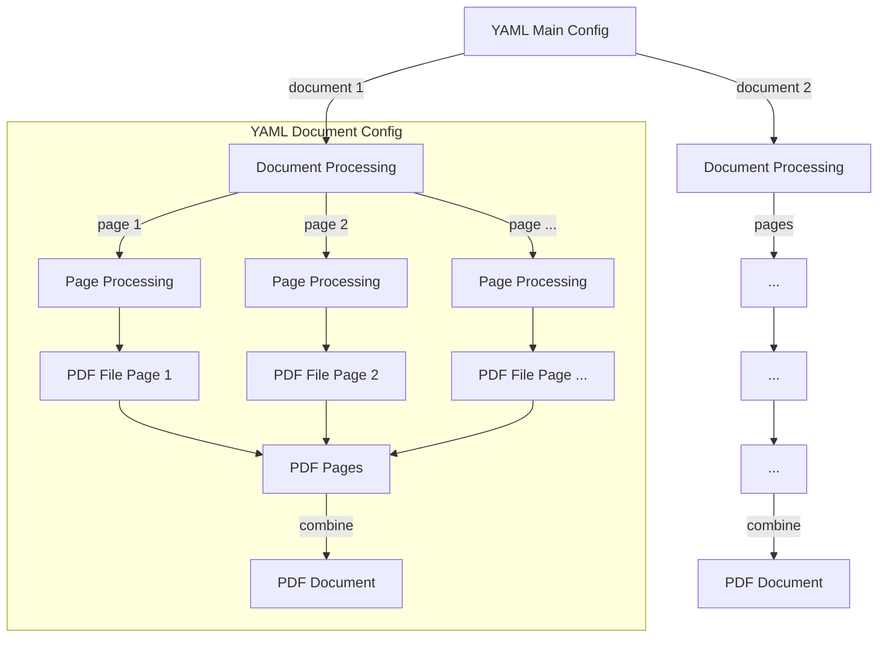
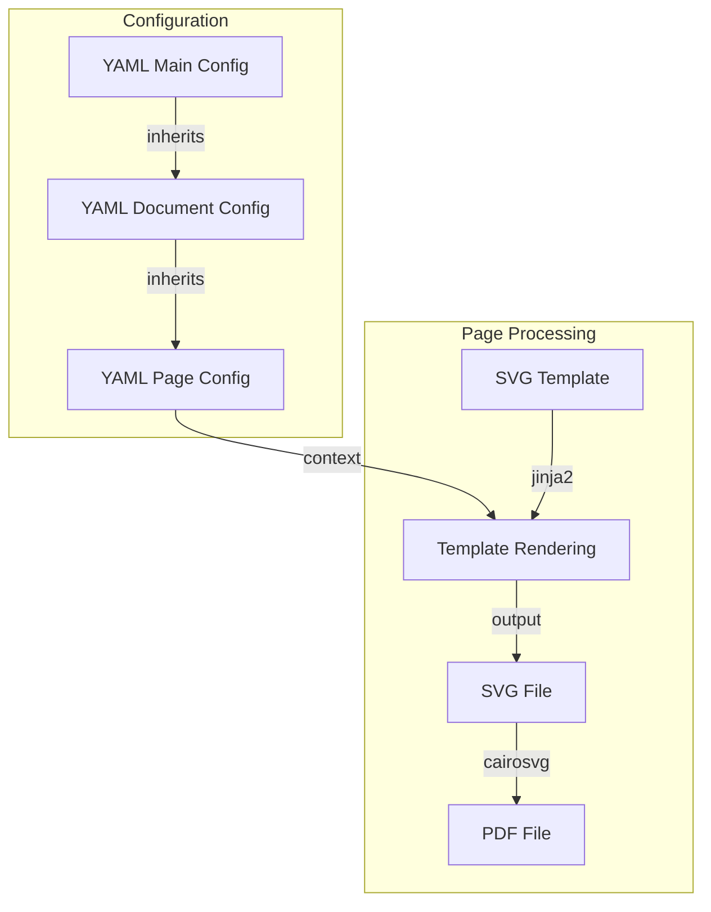
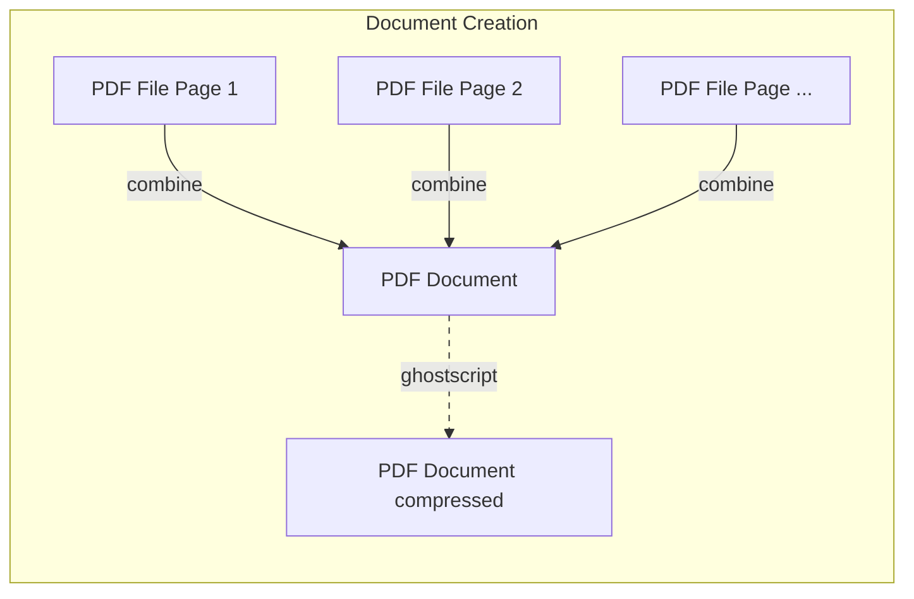

# pdfbaker Overview

pdfbaker creates PDF documents from SVG templates and YAML configuration. Quick and easy
out of the box, it's flexible enough to allow for heavy customisation.

- **SVG**: Full control over document layout and design
- **Jinja2**: Replace static content in your SVG with variables, conditions, loops
- **YAML**: Configure your content in plain text
- **PDF**: Your end result, optionally compressed

## Use cases

Use SVG to create documents that need precise positioning, complex layouts with
overlapping elements, specific fonts or custom shapes:

- Posters and flyers
- Marketing materials (brochures, prospectuses)
- Fancy reports and certificates
- Any document requiring precise design control

Configuring and editing content in plaintext YAML files is great if you create the same
types of documents again and again.

Use pdfbaker as a command line tool or Python library.

## When not to use pdfbaker

- When you need something other than PDF
- When flexible document flow is more important than precise positioning

You may want to consider using an Office Suite, HTML/CSS, Markdown or a text-first tool
like LaTeX, even if your end result is exported to PDF.

## Advanced features

- [Configuration Reference](configuration.md) - All available settings
- [Document Variants](variants.md) - Create multiple versions of the same document
- [Custom Processing](custom_processing.md) - Provide page content from anywhere

## Workflow

1. Create your document in an SVG editor or convert to SVG
2. Replace text with variables, add conditions and loops using Jinja2
3. Configure your content and settings in YAML
4. Generate PDFs with `pdfbaker yourconfig.yaml`

Where your SVG had

```xml
<text x="20" y="40" font-family="Arial" font-size="12" fill="#333333">My Document</text>
```

you turn that into

```xml
<text x="20" y="40" font-family="Arial" font-size="12" fill="#333333">{{ title }}</text>
```

and add your custom variable to the YAML configuration:

```yaml
title: "My Document"
```

When you run pdfbaker with your configuration file, `{{ title }}` in your SVG template
will be replaced with the value of `title` from your YAML configuration.

This means you can update your document's content just by editing the YAML file, without
changing the SVG template itself. For guidance on where to place different settings or
variables, see the section ["Inheriting common values"](#inheriting-common-values)
below.

### Quickstart: Create templated PDF from an SVG

Configuring your SVG with YAML requires a main configuration and at least one document
and one page configuration as well as at least one template. Use `--create-from` to set
this all up for an existing SVG file:

1. Design your document in an SVG editor or convert to SVG.
2. Run the following command to scaffold a new project and generate your first PDF:

   ```bash
   pdfbaker --create-from mydesign.svg myproject/myproject.yaml
   ```

   This will create a directory structure like:

   ```bash
   myproject
   ├── myproject.yaml
   └── mydesign
       ├── config.yaml
       ├── pages
       │   └── main.yaml
       └── templates
           └── main.svg.j2
   ```

   and produce your PDF in `myproject/dist/mydesign/mydesign.pdf`.

3. Edit the template and YAML files to customize your content and variables. This
   directory structure is just a starting point. Add more documents and customize as
   needed.

4. For future builds, just run:

   ```bash
   pdfbaker myproject/myproject.yaml
   ```

   to regenerate your PDFs.

See the documentation on [Usage](usage.md) for this and other options that can assist
you.

### From configuration to PDF documents

Your main configuration defines which documents to create.<br>Each document
configuration defines which pages make up the document.



### Inheriting common values

Settings in the main configuration are available to all documents.<br>Settings in a
document configuration are available to all of its pages.<br>Each page configuration can
hold page-specific settings/content, so that the template of the page is only
responsible for layout/design.



### Pages make up a document

After each page template was rendered and the resulting SVG file converted to PDF, these
page PDFs are combined to create the document.<br>This PDF document may optionally get
compressed for a nice end result.



## Examples

See the [examples](examples) directory:

- [minimal](examples/minimal) - Basic usage
- [regular](examples/regular) - Standard features
- [variants](examples/variants) - Document variants
- [custom_locations](examples/custom_locations) - Custom file/directory locations
- [custom_processing](examples/custom_processing) - Custom processing with Python

## Getting Help

If something doesn't work as advertised or is not clearly enough documented, please
[open an issue](https://github.com/pythonnz/pdfbaker/issues) on GitHub.
